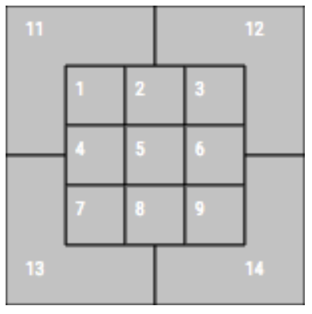

```{r setup, include=FALSE}
knitr::opts_chunk$set(
	message = FALSE,
	warning = FALSE
)
```

```{r}
library(tidyverse)
library(extracat)
library(shiny)
library(GeomMLBStadiums)
library(viridis)
library(parcoords)
```


# I. Introduction

The goal of this project was to explore various questions related to Major League Baseball. Here is a quick description of each topic:

* [Home runs](#hr) - How have home run rates behaved in recent history?
* [Team stats](#team) - How have teams performed in certain metrics in recent history?
* [Pinch hitter swing rates](#ph) - Do pinch hitters swing more often?
* [Pitch sequencing](#pitch) - What are the most common pitches that follow a certain sequence of previous pitches?
* [Plate discipline](#pd) - Can we use a heat map to identify how well a batter selects pitches to swing at?
* [Guarding a bunt](#bunt) - What pitches are thrown when the batter is going to bunt?
* [Spray chart by pitch](#spray) - Where does a batter hit the ball based on the type and location of the pitch?

# II. Data sources

### Pitch by pitch Statcast data (2019)

Statcast is an advanced tracking system that collects data on the movement of the baseball and the players for every pitch in a Major League Baseball (MLB) game. Variables include pitch velocity, movement, and spin rate, exit velocity and launch angle of a batted ball, and game situation information such as the players, inning, count, number of outs, etc. We used the 2019 data (including the playoffs), which consists of 743,495 pitches. The data was gathered from Baseball Savant, which  via the Search page (https://baseballsavant.mlb.com/statcast_search).

### FanGraphs Team Statistics (2010-2019)

FanGraphs is a website that develops and publishes statistics of MLB players and teams. We selected team statistics, seperated by season, for each of the last 10 seasons. The data was downloaded as a .csv file after applying the appropriate filters to the team stats batting leaderboard page (https://www.fangraphs.com/leaders.aspx?pos=all&stats=bat&lg=all&qual=0&type=8&season=2019&month=0&season1=2010&ind=1&team=0,ts&rost). The variables are mostly offenseive statistics, such as home runs and on-base percentage. Internally developed stats, such as Off (offense value), Def (defensive value), BsR (base running value), and WAR (also referred to as fWAR since other entities calculate WAR using their own methods) are also included. There are 300 total observations, with 10 seasons worth of stats for each of the 30 teams in MLB.


# III. Data Transformation

Due to the large number of observations, it was necessary to download the pitch by pitch data one week at a time. Once we had all of the .csv files, we combined them into one .rda file. The team statistics data set was read in directly from the .csv file. Since we are drawing from a large number of total variables, particularly in the pitch by pitch set which has 89, we decided to transform the variables as needed throughout the analysis instead of making all of the adjustments at the start. Most of the transformations consisted of adjusting class type, and some new variables were created as needed.


# IV. Missing values


After loading in the pbp2019 data set that will be used throughout this analysis, we will first examine the missing values. The data set has too many features to make use of an easy visualization, but a few clear trends exist after looking at the column missing values and taking a look at the data. Many variables such as pitcher, batter, strikes, and balls, have no missing values, while others have large amounts. The explanation for this is intuitive: each pitch represents a row of data and the values without missing values are the values that exist no matter the outcome of the pitch. While many of the variables missing many values depend on the outcome of the pitch. A couple examples: launch_angle will be missing if the ball was not hit. on_2b will be missing if no one is on second base.

Interestingly, we see related variables share the same total count of missing variables, such as all of the fielder_ variables having a missing value of 3159. The best explanation of this is that some ballparks (games in different countries) may not have measured these variables. 

After looking at the colMeans, we see that a few variables are missing for every value in the dataset, so we drop them from the data frame. 

Note the returned values from this analysis are hidden to save space, but can be commented out in the code to check.

```{r}
load('pbp2019.rda')
pbp2019[pbp2019=='null']<- NA

# colSums(is.na(pbp2019)) %>% sort(decreasing=TRUE)

# colMeans(is.na(pbp2019))

drop <- c('spin_dir', 'spin_rate_deprecated','break_angle_deprecated','break_length_deprecated','tfs_deprecated','tfs_zulu_deprecated','umpire') # columns missing every value
pbp2019 <- pbp2019[,!(names(pbp2019) %in% drop)] # drop useless columns
```


The season data frame has no missing values, as it is an aggregated data set over the season.


```{r}
# read in season data frame
season_data <- read.csv('FanGraphs_Leaderboard.csv')

colnames(season_data)[1] <- 'Season'
season_data[season_data=='null']<- NA
# colSums(is.na(season_data)) %>% sort(decreasing=TRUE)
```


# V. Results

## Home runs {#hr}

An often noted trend in MLB has been the increase in home runs, so we will look at a histogram faceted by season to see if teams tended to hit more home runs in recent years than previously. Clearly, this trend is noted for a reason as the histogram dramatically shifts over the years.  

```{r}
ggplot(season_data)+
  geom_histogram(aes(x = HR), fill = "lightBlue", col = "black") +
  ggtitle("Home runs each season")+
  facet_wrap(~Season)

```

Looking at how each team's home run totals have changed over the past few years is useful, but as can be seen in the graph below, including all 30 teams is a little crowded. 

```{r}
ggplot(season_data, aes(Season, HR, color = Team)) + geom_line() +
    ggtitle("Home runs over time") +
    labs (x = "Season", y = "Total home runs") +
    scale_x_continuous( breaks= c(2010,2015,2019))+
    theme_grey(16) +
    theme(legend.title = element_blank())

```

Therefore, we will look at comparing the Yankees and Twins, the two teams who took part in an incredible home run race last year to see how both teams have changed over the past 10 years. Clearly the Yankees have shown more consistent home run ability than the Twins. 

```{r}
hr_race <- c('Yankees', 'Twins')
temp_hr <- season_data[season_data$Team %in% hr_race,]

ggplot(temp_hr, aes(Season, HR, color = Team)) + geom_line() +
    ggtitle("Home runs over time NYY vs. MIN") +
    labs (x = "Season", y = "Total home runs") +
    scale_x_continuous( breaks= c(2010,2015,2019))+
    theme_grey(16) +
    theme(legend.title = element_blank())


```


## Team stats {#team}

WAR is a new-age baseball statistic that is widely regarded as being the most comprehensive measure of a player or team's success. For this reason, the following graph shows each team's total WAR for a season over the last 10 seasons. Basically, the graph exhibits how consistent each team has been (the spread of data), as well as how successful the team has been (the further right the histogram is the more successful). A few examples: the Rockies have been consistent, but not very successful, the Astros have been very inconsistent, but had some very successful years in this period. 

```{r}
ggplot(season_data)+
  geom_histogram(aes(x = WAR), binwidth=3, fill = "lightBlue", col = "black") +
  ggtitle("WAR by team over time")+
  facet_wrap(~Team)
```

Comparing WAR for teams from the NL East will give us a great idea of which teams in the division have been consistent and which have been successful. The graph creates an interesting way to track the trajectory of each team over the past decade. The Phillies were very successful early in the decade, only to fall off greatly in the middle parts, and begin their rise back up over the last couple of years.

```{r}
nl_east <- c('Marlins','Mets','Nationals','Phillies','Braves')
temp_nl <- season_data[season_data$Team %in% nl_east,]


ggplot(temp_nl, aes(Season, WAR, color = Team)) + geom_line() +
    ggtitle("WAR over time NL East") +
    labs (x = "Season", y = "Total WAR") +
    scale_x_continuous( breaks= c(2010,2015,2019))+
    theme_grey(16) +
    theme(legend.title = element_blank())

```

To continue comparing the teams within the NL East, we read in a data set from fangraphs.com that is just the aggregate of the season_stats we have been using for each team. We wanted to compare how each of the teams compare across each statistical category. The analysis provides a comprehensive view about the categories each team has performed well in against the other teams in the division. 

A few clear insights appear. First, the Nationals are the best in almost every category, except for Def (defensive rating), where the Braves have been the best over the years. Secondly, the Marlins have been worst in just about every category except for BABIP (batting average on balls in play) which is known to be the most random statistic in baseball. The performance of the teams over the decade seem to make a clear order based on the chart: Nationals > Braves/Mets > Phillies > Marlins. 

```{r}
# from before nl_east <- c('Marlins','Mets','Nationals','Phillies','Braves')
agg_season_data <- read.csv('agg_leaderboard.csv')
temp_agg_nl <- agg_season_data[agg_season_data$Team %in% nl_east,]

row.names(temp_agg_nl) <- temp_agg_nl$Team
temp_agg_nl$Team <- NULL

season_scaled <- data.frame(scale(temp_agg_nl)) %>%
  rownames_to_column() %>%
  gather(colname, value, -rowname)


ggplot(season_scaled, aes(x = rowname, y = colname, fill = value)) +
  geom_tile() + scale_fill_viridis() +
  ggtitle("Team Stats scaled")

```

Finally, we can analyze the relationships between these statistics using the following interactive parallel coordinates plot.

```{r}
parcoords(agg_season_data,
          rownames = F,
          brushMode = "1D-axes",
          reorderable = T,
          queue = T)  

```

If we filter on WAR, the Red Sox, Yankees, and Dodgers have been easily the most successful teams over the decade. Breaking down by type of production, the Yankees and Red Sox were far and away the top offensive teams, the Giants and Diamondbacks were the best defensively, and the Rangers, Yankees, Padres, and Indians were the best base runners. Overall, those four metrics have inconsistent interactions, which makes sense because different teams accumulated WAR in different ways. However, if we move Off next to WAR, we see that Off is more positively associated with WAR than the others. In other words, offensive value is the most important factor in determining total production, which makes logical sense. The most direct relationship is that runs scored (R) and runs batted in (RBI) match up almost perfectly, which is a trivial observation since almost every run scored is driven in by a batter. 


## Pinch hitter swing rates {#ph}

There is a general sense in baseball that pinch hitters are more likely to swing away. Since it is likely their only plate appearance in the game, the thought is that there is no reason to take a few pitches to get a look at the pitcher or ease their way into the game. To examine this theory, we first needed to identify pinch hitters. Note the data does not give this information directly. So, we used the game information - namely the players currently on the field - to determine when a batter enters the game before being on the field. Since the data does not provide information on the designated hitter, this method will not work for games played in American League ballparks. This is not a major problem, as most pinch hitting happens in the National League, so we focus the analysis on National League pinch hitters.

```{r}
# sort pitches sequentially within each game
pbp_ordered <- pbp2019 %>%
  mutate(game_date = as.Date(game_date, "%m/%d/%Y")) %>%
  arrange(game_date, home_team, inning, desc(inning_topbot), at_bat_number, pitch_number)

# restrict to NL games since no info on DH
nl_games <- pbp_ordered %>%
  filter(home_team %in% c("NYM","WSH","PHI","MIA","ATL",
                          "CHC","CIN","STL","PIT","MIL",
                          "ARI","LAD","SF","COL","SD"))

# determine whether pinch hitter
nl_games$ph <- NA
nl_games_ph <- as.list(nl_games)
for(row in 1:nrow(nl_games)){
  if(nl_games_ph$inning[row] == 1 & nl_games_ph$inning_topbot[row] == "Top"){
    nl_games_ph$ph[row] <- 0
  } else{
    if(nl_games_ph$inning_topbot[row] != nl_games_ph$inning_topbot[row-1]){
      fielders <- list(as.character(nl_games_ph$pitcher.1[row-1]), nl_games_ph$fielder_2.1[row-1],
                       nl_games_ph$fielder_3[row-1] ,nl_games_ph$fielder_4[row-1],
                       nl_games_ph$fielder_5[row-1], nl_games_ph$fielder_6[row-1],
                       nl_games_ph$fielder_7[row-1], nl_games_ph$fielder_8[row-1],
                       nl_games_ph$fielder_9[row-1])
    }
    nl_games_ph$ph[row] <- ifelse(as.character(nl_games_ph$batter[row]) %in% fielders,0,1)
  }
}
nl_games_ph <- as.data.frame(nl_games_ph)    


nl_games_ph_swings <- nl_games_ph %>%
  filter(!(description %in% c("bunt_foul_tip","foul_bunt","missed_bunt",
                              "pitchout","hit_by_pitch"))) %>%
  mutate(swing = ifelse(description %in% c("foul","foul_tip","hit_into_play",
                                           "hit_into_play_no_out","hit_into_play_score"),1,0))
```

```{r include=FALSE}
# all
nl_games_ph_swings %>%
  group_by(ph) %>%
  summarize(pitches = n(),
            swing_rate = sum(swing) / pitches)
```

```{r fig.width=4}
df <- data.frame(pinch_hitter = c("No","Yes"),
                 swing_rate = c(.363,.340))

ggplot(df, aes(pinch_hitter, swing_rate)) +
  geom_col(fill = "cornflowerblue") +
  labs(title = "Swings Rates by Batter Type", x = "Pinch Hitter?", y = "Swing Rate")
  

```

Interestingly, the swing rate for pinch hitters was lower in 2019. To go a bit further, consider the differences in some particular game situations. Namely, on the first pitch of a plate appearance (first), when there are in runners in scoring position (risp), and when it is the 7th inning or later in the game (late):

```{r eval=FALSE}

# first
nl_games_ph_swings %>%
  filter(pitch_number == 1) %>%
  group_by(ph) %>%
  summarize(pitches = n(),
            swing_rate = sum(swing) / pitches)

# risp
nl_games_ph_swings %>%
  filter(on_2b != "null" | on_3b != "null") %>%
  group_by(ph) %>%
  summarize(pitches = n(),
            swing_rate = sum(swing) / pitches)

# risp, first
nl_games_ph_swings %>%
  filter(on_2b != "null" | on_3b != "null", pitch_number == 1) %>%
  group_by(ph) %>%
  summarize(pitches = n(),
            swing_rate = sum(swing) / pitches)

# late
nl_games_ph_swings %>%
  filter(inning >= 7) %>%
  group_by(ph) %>%
  summarize(pitches = n(),
            swing_rate = sum(swing) / pitches)

# risp, late
nl_games_ph_swings %>%
  filter(inning >= 7, on_2b != "null" | on_3b != "null") %>%
  group_by(ph) %>%
  summarize(pitches = n(),
            swing_rate = sum(swing) / pitches)

# risp, late, first
nl_games_ph_swings %>%
  filter(inning >= 7, on_2b != "null" | on_3b != "null", pitch_number == 1) %>%
  group_by(ph) %>%
  summarize(pitches = n(),
            swing_rate = sum(swing) / pitches)

```

```{r}
# create data frame with results
df <- data.frame(situation = c("all","all","first","first",
                               "risp","risp","risp + first","risp + first",
                               "late","late","risp + late","risp + late",
                               "risp + late + first","risp + late + first"),
                 ph = factor(c(0,1,0,1,0,1,0,1,0,1,0,1,0,1)),
                 swing_rate = c(.363,.340,.230,.201,.380,.351,.266,.212,
                                .362,.337,.377,.344,.263,.206))

# cleveland dot plot
theme_dotplot <- theme_bw(15) +
  theme(axis.text.y = element_text(size = rel(.75)),
        axis.ticks.y = element_blank(),
        axis.title.x = element_text(size = rel(.75)),
        panel.grid.major.x = element_blank(),
        panel.grid.major.y = element_line(size = 0.5),
        panel.grid.minor.x = element_blank())

ggplot(df, aes(x = swing_rate,
               y = fct_reorder2(situation,
                                ph == "1",
                                swing_rate,
                                .desc = FALSE),
               color = ph)) +
  geom_point(size = 3) +
  labs(title = "Swings Rates by Situation", x = "Swing Rate", y = "", color = "Pinch Hitter?") +
  scale_color_manual(labels = c("No", "Yes"), values = c("darkorange", "blue")) +
  theme_dotplot

```

We have another surprising result, as in every case the swing rate is lower for pinch hitters. This contradicts the initial theory, but it is important to remember this is only based on 2019. It may be the case that pinch hitters were more aggressive in the past, but their behavior has changed over time. Another interesting piece of this graph is that swing rates among categories have the same sorted order, with more swings occuring with runners in scoring position and less swings on the first pitch.

## Pitch sequencing {#pitch}

For this section, refer to this chart which classifies pitch location by numbers (from the catcher's perspective):



Pitchers throw different pitches for different reasons. Some pitches move more than others, while others are thrown with more speed. Therefore, we wanted to compare the pitch speed based on different type of pitches. The first observation is that some pitches occur with a much higher frequency than others. As expected, the pitches create normal distributions with the means of each pitch varing greatly by pitch. Four-seam fastballs (FF) are known for being the most utilized and fastest pitch, which the chart verifies. Additionally, some pitches such as sliders (SL) have a wider range of speeds with which they are thrown. For baseball fans, this is also to be expected as sliders are harder to classify and come in many forms. 

```{r}
pbp2019 <- transform(pbp2019, plate_x = as.numeric(plate_x), plate_z = as.numeric(plate_z), release_speed = as.numeric(release_speed), hc_x = as.numeric(hc_x),hc_y = as.numeric(hc_y), launch_speed = as.numeric(launch_speed)) # correcting column formats

empty_pt <- c('','EP','FO','KN',NA) # the following pitches do not have enough data to make meaningful analysis, so we will remove

temp_pt <- pbp2019[! pbp2019$pitch_type %in% empty_pt,] # remove the above pitches 

ggplot(temp_pt)+
  geom_histogram(aes(x= release_speed), binwidth=1, fill = "lightBlue", col = "black") +
  ggtitle("Pitch speed by type")+
  facet_wrap(~pitch_type)

```

Now, consider pitch speeds by location.

```{r}
# pitch speeds based on the zone
ggplot(drop_na(pbp2019,zone),aes(x=reorder(zone,-as.numeric(release_speed),median), y=as.numeric(release_speed)))+
  geom_boxplot(fill = "skyblue", col = "black") +
  labs(title = "Pitch Speed By Location", x = "Zone", y = "Speed")
```

We can see that zone 7 has a much tighter range of speeds (low corner of box) compared to zone 11 (high out of box). This reflects the fact that there are wild, accidental, low speed pitches up and out of the zone. It is interesting to see that the median speed for zones 13 and 14 (below the zone) are much lower than the median speeds in any other zone. Predictably, the zones that are have the next lowest speeds are 7, 8, and 9 which is the bottom row of the zone. This shows that the pitchers' strategy is to disguise whether the ball will be in for a low strike or a bit slower and too low to get the batter to chase the pitch. It is also interesting that pitches thrown up in the zone or too high out of the zone are the fastest pitches on average, while pitches thrown right down the heart of the zone are of medium velocity compared to the other zones. The high pitches are the fastest on avg because it's very hard for the hitter to get their bat through the zone in time to catch up to a high fastball.

Next, we examine the pitches most used to get a first pitch strike. First we will visualize the optimal pitches in a vacuum, meaning that we will only look at the count and not the history of previous pitches.

```{r}
balls <- pbp2019$balls
strikes <- pbp2019$strikes
pitch_type <- pbp2019$pitch_type
release_speed <- pbp2019$release_speed
description<- pbp2019$description

des2 <- as.numeric(as.factor(pbp2019$description))

pbp2019 <- cbind(pbp2019,des2)

#looks at swinging and called strikes
strike_gained <- pbp2019[des2 ==14 | des2== 4,]

#adds fouled off which is useful when the batter has 0 or 1 strike in the count
strike_gained_foul <- pbp2019[des2 ==14 | des2== 4 | des2==5 | des2==7| des2==15,]

#optimal first pitch
firstpitch <- pbp2019[strikes ==0 & balls== 0,]

successful_first_pitch <- pbp2019[strikes ==0 & balls== 0 & (des2 ==14 | des2== 4 | des2==5 | des2==7| des2==15),] 
  
ggplot(drop_na(successful_first_pitch[successful_first_pitch$pitch_type!="",],pitch_type), aes(x=fct_infreq(pitch_type))) +
  geom_bar(fill = "cornflowerblue", col = "black") +
  labs(title = "First Pitch Strikes", x = "Pitch Type")

```

The most common such first pitch by far is the four seam fastball and the slider is a distant second. A reason for this may be that the four seam fastball is the fastest pitch in baseball, and the pitcher is challenging the batter's reaction time on the first pitch. The batter will theoretically not be completely in tune with the pitcher's delivery and will react a bit slower. Now consider the location of the pitches.

```{r}
ggplot(drop_na(successful_first_pitch,zone), aes(x=fct_infreq(zone))) +
  geom_bar(fill = "cornflowerblue", col = "black") +
  labs(title = "First Pitch Strikes", x = "Zone")

```

Zones 4,5,6,8,and 9 are significantly in the lead for the most popular first pitch location. 4,5,6,8 are right in the heart of the plate, which shows that pitchers are keen to start off the at-bat with a strike and don't want to risk pitching near the edge of the zone and risk pitching a ball when many batters are inclined to take the first pitch, giving the pitcher a "free" strike. Next, to get the full picture, we look at first pitches that were balls.

```{r}
ball_first_pitch <- pbp2019[strikes==0 & balls==0 & (des2==1 | des2==2),]

ggplot(drop_na(ball_first_pitch,pitch_type), aes(x=fct_infreq(pitch_type))) +
  geom_bar(fill = "cornflowerblue", col = "black") +
  labs(title = "First Pitch Balls", x = "Pitch Type")
```

We see that the four seam fastball and slider are basically the exclusive first pitch of choice as they are by far the most common for both strikes and balls. The location of the first pitch balls provide interesting insight.

```{r}
ggplot(drop_na(ball_first_pitch,zone), aes(x=fct_infreq(zone))) +
  geom_bar(fill = "cornflowerblue", col = "black") +
  labs(title = "First Pitch Balls", x = "Zone")
```

This graph is very telling because the most common ball locations were 13 and 14, which are both very low out of the zone. This reflects the fact that the pitchers are risk averse on the first pitch and would rather try to get a strike low in the edge of the zone than risk throwing up in the zone. (High strikes are more likely to be hit for homeruns and extrabases.) Now we look at successful pitches when the pitcher is ahead in the count with 1 strike and 0 balls.

```{r}
successful_second_pitch_ahead <- pbp2019[strikes ==1 & balls== 0 & (des2 ==14 | des2== 4 | des2==5 | des2==7| des2==15),] 

ggplot(drop_na(successful_second_pitch_ahead,zone), aes(x=fct_infreq(zone))) +
  geom_bar(fill = "cornflowerblue", col = "black") +
  labs(title = "0-1 Count", x = "Zone")
```

Zones 13 and 14 (well below the strike zone) are by far the most popular. This illustrates the clear advantage a pitcher has when they are ahead in the count as they can be risk averse and throw the ball low, yet still be successful and get a second strike at the same time. Finally, we look at successful pitches where the pitcher is behind with 1 ball and no strikes.

```{r}
successful_second_pitch_behind <- pbp2019[strikes ==0 & balls== 1 & (des2 ==14 | des2== 4 | des2==5 | des2==7| des2==15),] 

ggplot(drop_na(successful_second_pitch_behind,zone), aes(x=fct_infreq(zone))) +
  geom_bar(fill = "cornflowerblue", col = "black") +
  labs(title = "1-0 Count", x = "Zone")
```

Significantly, the most successful was zone 5 and zone 8. 5 is precisely in the middle of the strike zone (a very dangerous place to throw the ball) and 8 is also in the middle of the plate. This illustrates the challenges a pitcher has when they fall behind in the count because for them to gain the upper hand in the at-bat they have to take more risks and pitch closer to the middle of the plate.

Next, we consider the relationship between consecutive pitches.

```{r}
pbp_seq <- pbp_ordered %>%
  # create new variables with previous results
  mutate(prev_pitch_number = lag(pitch_number),
         prev2_pitch_number = lag(prev_pitch_number),
         prev_pitch_type = lag(pitch_type),
         prev2_pitch_type = lag(prev_pitch_type),
         prev_zone= lag(zone),
         prev2_zone=lag(prev_zone))%>%
  # check that the previous pitches were in the same at bat
  mutate(prev_pitch_type = ifelse(prev_pitch_number < pitch_number, prev_pitch_type, NA),
         prev2_pitch_type = ifelse(prev2_pitch_number < pitch_number - 1, prev2_pitch_type, NA),
         prev_zone = ifelse(prev_pitch_number < pitch_number, prev_zone, NA),
         prev2_zone= ifelse(prev2_pitch_number < pitch_number-1,prev2_zone,NA))
```

First, consider the pitch distribution when the first two pitches of an at bat are high and out of the zone.

```{r}
two_high_pitches <- pbp_seq[pbp_seq$prev_pitch_number==2 & pbp_seq$pitch_number == 3 & pbp_seq$prev2_pitch_number==1&(pbp_seq$prev_zone==11 | pbp_seq$prev_zone==12) & (pbp_seq$prev2_zone==11 | pbp_seq$prev2_zone==12),]

ggplot(drop_na(two_high_pitches,zone), aes(x=fct_infreq(zone))) +
  geom_bar(fill = "cornflowerblue", col = "black") +
  labs(title = "After Two High Pitches", x = "Zone")
```

This graph shows an interesting result, as after two high pitches out of the zone, the most popular 3rd pitch was far more likely to also be out of the zone. This suggests that even though the 2019 automatic walk rule is in place, (a pitcher can intentionally walk a batter without throwing a pitch) pitchers may still end up walking a batter by throwing pitches. A possible reason is that the first pitch or two that they threw was mistakenly wild and they decide at that point to just go ahead and walk the batter. Next, consider the distribution after a first pitch low strike.

```{r}
low_zone <- pbp_seq[pbp_seq$prev_pitch_number==1 & pbp_seq$pitch_number == 2 & (pbp_seq$prev_zone==7 | pbp_seq$prev_zone==8 | pbp_seq$prev_zone==9),]

ggplot(drop_na(low_zone,zone), aes(x=fct_infreq(zone))) +
  geom_bar(fill = "cornflowerblue", col = "black") +
  labs(title = "After a Low Strike", x = "Zone")
```

This graph reveals that after the first pitch was a strike in the lower part of the plate, the most likely second pitch will be low - too low for the zone to be exact. Pitcher's likely do this because they are ahead in the count and can afford to throw out of the zone. Additionally, they know that the batter may be worried that this second low pitch will also be called a strike by the umpire, so they can try to get the batter to chase a pitch that is too low. Finally, we plot the distribution after a first pitch high strike.

```{r}
high_zone <- pbp_seq[pbp_seq$prev_pitch_number==1 & pbp_seq$pitch_number == 2 & (pbp_seq$prev_zone==1 | pbp_seq$prev_zone==2 | pbp_seq$prev_zone==3),]

ggplot(drop_na(high_zone,zone), aes(x=fct_infreq(zone))) +
  geom_bar(fill = "cornflowerblue", col = "black") +
  labs(title = "After a High Strike", x = "Zone")
```

When the first pitch was a strike and high in the zone, as in the previous example, it is very common for the 2nd pitch to be low out of the zone. The key difference here, though, is that it is far more common for the pitcher to throw a ball high out of the zone in this case, which again reflects the pitcher trying to make the batter (who is now protecting the higher part of the strike zone) chase a high pitch. Protecting the plate means that in the batter's eyes, if a pitch that was on the edge of the strike zone was called a strike, the batter must "protect" this part of the zone swing on subsequent pitches that are also on the edge of this part of the strike zone to avoid another strike getting called by the umpire.

One last variable of interest is release position. Release position is the location of the pitcher's hand at the moment he releases the ball. Consider the horizontal release position by location.

```{r}
ggplot(drop_na(pbp_seq,zone),aes(x=reorder(zone,-as.numeric(release_pos_x),median), y=as.numeric(release_pos_x)))+
  geom_boxplot(fill = "skyblue", col = "black") +
  labs(title = "Release Point by Location", x = "Zone", y = "Horizontal Release Position")

```

The plot reveals that the horizontal release position can give some clues about where the pitch will be. If the release position is above 0, it is very unlikely for the ball to be thrown into zone 1 (upper corner of zone).

```{r}
ggplot(drop_na(pbp_seq[pbp_seq$pitch_type!="",],pitch_type),aes(x=reorder(pitch_type,-as.numeric(release_pos_x),median), y=as.numeric(release_pos_x)))+
  geom_boxplot(fill = "skyblue", col = "black") +
  labs(title = "Release Point by Pitch Type", x = "Pitch Type", y = "Horizontal Release Position")
```

The most common source of deception for a pitch is to alternate between a four seam fastball and a slider. The FF and SL pitches may both be released at a simple horizontal point at the median, but if the ball is released higher, closer to 0, it is far more likely to be a four seam fastball than a slider. It may be the case that batters, consciously or subconsciously, watch for the timing and location of the release point of the pitcher in his delivery of the pitch to know what pitch is coming.


## Plate discipline {#pd}

Heat maps have an obvious application to baseball in terms of the strike zone. Many different analyses can be done based off pitch location, such as hit type, swing percentage, etc. We are going to take the approach of comparing two batters' heat maps based on whether the pitch was a ball, strike, or put into play. Ideally, a batter would like to have a tightly bound cluster of pitch location put into play, with a small outer ring of swinging strikes, and anything not in the strike zone watched for a ball. 

To analyze, we chose one batter known for having a good eye of the strike zone (Mike Trout) and one known for swinging at anything (Lewis Brinson). The graph shows the expected result; that Trout (545361) has a much tighter zone of strikes/balls in play than Brinson (621446). Trout puts more balls in play within the zone and swings at less balls outside the zone. (Note B = ball, S = strike, X = in play).

```{r}
trout_brinson <- pbp2019 %>%
  filter(batter == 545361 | batter == 621446)


ggplot(trout_brinson)+
  geom_bin2d(aes(plate_x, plate_z, fill = type))+
  facet_grid(~batter) +
  labs(title = "Pitch Result", x = "", y = "")

```

## Guarding a bunt {#bunt}

We would like to examine how a pitcher handles a batter when he is about to bunt. Although there is no exact way to do this with the information the data set provides, one approximation is to consider pitches that were either bunted at and missed or bunted foul. These are examples when a batter has tried to lay down a bunt but failed.

```{r}
#unsuccesful bunts that were either fouled or missed
df <- pbp2019[(des2==12 | des2==3 | des2==6), ]
ggplot(drop_na(df,zone), aes(x=fct_infreq(zone))) +
  geom_bar(fill = "cornflowerblue", col = "black") +
  labs(title = "Failed Bunt", x = "Zone")

```

The most successful zones to pitch to were zones 11 and 5. Zone 11 makes a lot of sense because it is very difficult to bunt a high pitch especially higher than the strike zone. 5 does not make immediate sense given that this pitch is right down the middle. This suggests that while throwing the ball high is a good pitching strategy, successful bunting has less to do with pitch location and more to do with the skill of the bunter. Now, consider the pitch distribution where a successful sacrifice bunt has been executed.

```{r}
sac_bunt <- grep("sacrifice bunt",pbp2019$des)

t <- pbp2019[sac_bunt,]

ggplot(drop_na(t,zone), aes(x=fct_infreq(zone))) +
  geom_bar(fill = "cornflowerblue", col = "black") +
  labs(title = "Successful Bunt", x = "Zone")
```

Zones 5 and 11 were also very prevalent on successful bunts, which again shows that pitch location is not very important to prevent a successful bunt. The main thing learned is that zone 2 (upper middle part of the zone) is on average a worse place for the pitcher to attempt to prevent a successful bunt.

# VI. Interactive component

## Spray chart by pitch {#spray}

As outlined in Luke and Chris' community contribution project, the package GeomMLBStadiums can be used to create a spray chart for balls in play. We used a Shiny Application to make this tool as flexible as the user would like it to be. The app provides the opportunity to choose which batter to analyze, while restricting the pitch type to certain pitches and certain areas of the strike zone. The horizontal and vertical pitch location allow the user to restrict the pitches to certain areas. So questions of the following sort can be answered: "How does Christian Yelich hit pitches that are high and outside compared to pitches low and inside?" Enjoy the tool!

Link to the app: https://cfrusso.shinyapps.io/spray_chart_by_pitch/


# VII. Conclusion

## Limitations

One limitation the project faced was in analyzing the missing data. Particularly, the fact that the dataset was so large and was missing a large amount of data made the task of visualizing the missing data challenging. However, the data showed clear trends and reasons for this missing data that we were able to garner from different analyses. Another limitation was the choice to restrict our pitch by pitch data to the 2019 season. The benefit of this choice was that the 2019 data alone includes 743,495 observations, so additional seasons would quickly create a very large data set. The drawback is that we are unable to verify if the results of our analyses are consistent across years. In the analyses of pitch location, the zones do not specify whether a pitch was on the edge or in the middle of each zone. Analyzing those pitches would tell us when and why the pitcher is willing to risk his pitch getting called a ball. It would also be interesting to know the time between pitches so we could see if there are any patterns such as the pitcher slowing things down when they are behind in the count and speeding things up when they are ahead.

## Future Analysis

The Shiny application created in the project builds a solid structure around a great idea, and, for the future, we would love to continue building this application into a more user friendly and robust analysis tool for baseball fans and analysts alike. An interesting expansion to the pinch hitter swing rate analysis presented above would be to run the same comparisons on different years. For example, if we could compare the current swing rates to those in the 1980's or even the 1960's, we could determine if the perception of pinch hitters being more aggressive was true at some point, or if it was always a misconception as it proved to be in 2019. Finally, quantifying the utility of each pitch for any part of the zone would be interesting. This would answer questions such as why a fastball in the lower corner would be better than in the higher corner. Quantifying why left-handed pitchers prefer facing lefty batters and why right-handed pitchers prefer facing righty batters would also be an interesting project.

## Lessons Learned

One lesson learned through this project and throughout the semester, was that the first step in analysis should be questions. Large data sets contain an enormous amount of potential analyses, so the first step should always be to decide what questions to attempt to answer before diving into analysis. The questions we chose are by no means exhaustive of the insights these data sets can provide, but they allowed us to narrow our focus. It also helps to start with some simple analyses to master the more basic conclusions before trying to find some deep and meaningful statistical pattern in the data. Another takeaway is that it is not always necessary to build a complex statistical model in order to obtain significant information. A simple graph plotting differences between groups reveals a relationship that contradicts conventional wisdom about pinch hitters, while also providing a consistent order of batter aggresiveness in certain game situations. This is an instructive result which affirms the idea that sometimes a simple solution provides the best answer.

Link to GitHub repository: https://github.com/lcbeas/EDAV_Final
